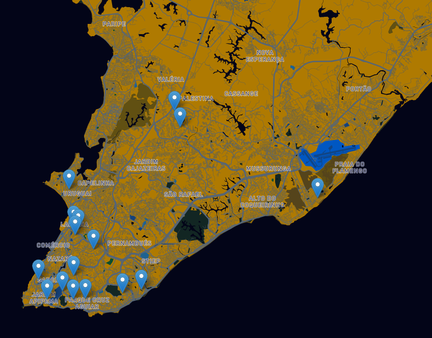

<h1 align="center">
Members
</h1>


<p align="center">
Mapa interativo da localização dos membros da TITAN - Empresa Júnior de Engenharia da Computação
</p>

<div align="center">
  <br />
  
</div>

## Tecnologies


This project was developed using cutting edge front-end technologies.


- [ReactJS](https://reactjs.org/)
- [Typescript](https://www.typescriptlang.org/)
- [Next.js](https://nextjs.org/)
- [Leaflet](https://leafletjs.com/)
- [GrapQL](https://graphql.org/)

## 💻 Preview

```bash
https://members.vercel.app/
```

---

Made with 💜 by [Camilla Correia](https://www.linkedin.com/in/camillacorreia)
